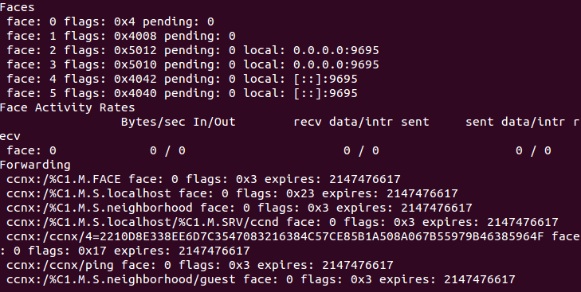
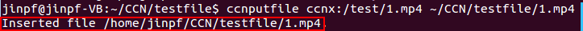
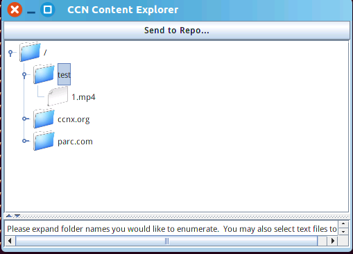
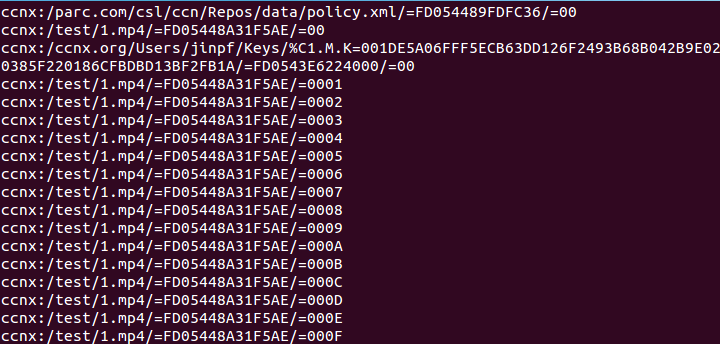

#CCNx常用命令
记录CCNx版本为0.8.2
##ccndstart
启动ccnd

查看ccnd设置的环境变量使用命令： `ccnd -h`

设置环境变量可以通过修改 `~/.profile`，即：
<!--lang:shell-->
	vi ~/.profile
	#在末尾添加要设置的变量，保存，如：
	#将ccnd的启动运行日志保存在 ~/CCN/log/ccnd_log 文件中
	export CCND_LOG=$HOME/CCN/log/ccnd_log
	#或者直接在命令行输入以上命令
	source ~/.profile
	#之后运行ccndstart就不会在命令行显示日志消息
	ccndstart

我的 `.profile` 文件配置如图：

##ccndstop
关闭ccnd

##ccndstatus
显示正在运行的ccnd的运行状况统计，包括接口（Face）信息、转发（Forwarding）信息等。

##ccndc
配置FIB及相关转发策略。输入 `ccndc -h` 可以查看相关用法。

示例：

在两台电脑上分别用ccndc命令添加ccnd转发表项：
<!--lang:shell-->
	# A机添加到B机通信的转发表项（如）：
	ccndc  add ccnx:/jinpf.chat udp 10.0.2.4（B机IP）
	# B机添加到A机通信的转发表项（如）：
	ccndc  add ccnx:/jinpf.chat udp 10.0.2.15（A机IP）
	
	#添加结果可以通过ccndstatus命令查看

删除刚添加的FIB路由表项

在A机上，首先输入 `ccndstatus` 查看，显示如下：

注意：faceid：7为手动添加的表项

执行命令：
<!--lang:shell-->
	ccndc del ccnx:/jinpf.chat face 7
	ccndc destroy face 7	

之后执行命令 `ccndstatus` 查看，显示如下：

相关表项已被删除

除了上述方法，最简单的删除表项的方法就是先执行 `ccndstop` ，再执行 `ccndstart`。

##ccnr
建立一个本地的CCN仓库，用来存放CCNx中的内容，如果有interest包请求该内容就对其做出响应（该命令尚未详细了解，存在很多疑惑）

默认情况下执行 `ccnr` 命令会在当前目录下生成以下一个文件夹和三个文件： `index` 、 `ccnx_repository_keystore` 、 `repoFile1`
、 `repoPolicy`

可以使用 `ccnr -h` 命令查看仓库设置的一些环境变量参数，其中有设置仓库位置的 `CCNR_DIRECTORY` 变量。设置环境变量可以通过修改 `~/.profile`（注意：只有先启动 `ccnr` 命令后再使用 `ccnr -h`才能看到已经修改配置的环境参数）

我的 `.profile` 文件配置如图：

##ccnputfile
将文件放到CCN仓库中（前提是已经打开了ccnd，建立了本地的仓库）。可以使用 `ccnputfile -h` 查看如何使用

最简单用法： `ccnputflie ccnx:/test/1.mp4 ~/CCN/testfile/1.mp4` 即后面两个参数一个为ccnx中的名字，一个为现在文件系统中的位置。如果执行成功会显示： `Inserted file ...`如图：

##ccnexplore
一个GUI的文件浏览程序，目前还存在很多bug。直接运行效果如图：

##ccnnamelist
列出给定仓库存储内容的名字：
示例：
<!--lang:-->
	ccnnamelist $CCNR_DIRECTORY/repoFile1 | less

效果：

##其它
* `ccnrpolicyedit` 修改ccnr中数据块命名策略，更多参考CCNx `doc/technical/RepoPolicies.html`
* `ccnls`
* `ccnlsrepo`
* `ccngetfile`
* ...