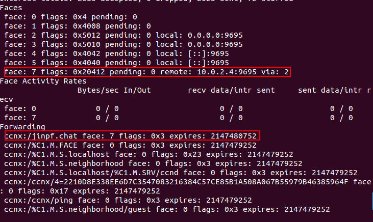

#ccndc simple usage
Command `ccndc` can be used to configure FIB and routing strategy. Use cmd `ccndc -h` can see it\`s usage.

To create a UDP or TCP tunnel to remote ccnd and create route toward it, use the following command :
<!--lang:shell-->
	ccndc add ccnx:<your designated name prefix> udp <other host IP>

For example:

Two machine A and B, B has content `/jinpf.chat` and IP address `10.0.2.4` , A wants to get it, A needs to use the following command :

<!--lang:shell-->
	ccndc add ccnx:/jinpf.chat udp 10.0.2.4

To view the result, use `ccndstatus`:

Attention: faceid:7 is automatic generated.

If you want to delete this FIB item after use, use the following command:

<!--lang:shell-->
	ccndc del ccnx:/jinpf.chat face 7
	ccndc destroy face 7