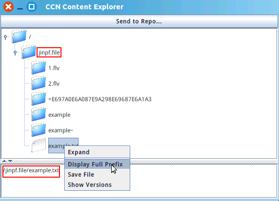
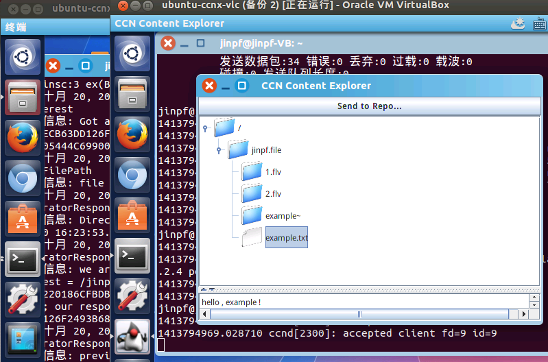
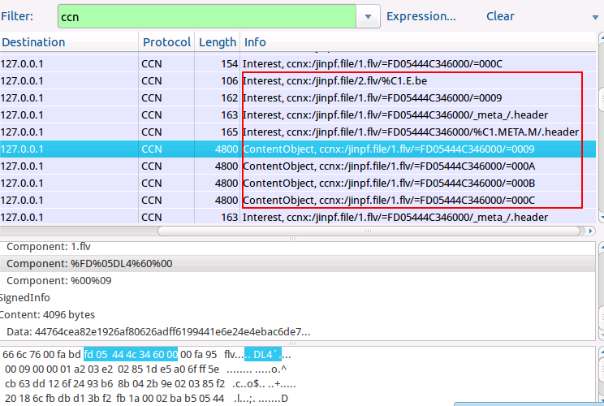
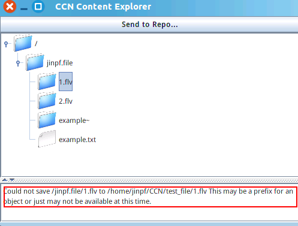

#CCNFileProxy 测试记录
ccnFileProxy是CCNx中文件代理服务器的例子，提供一种类似共享文件夹的功能。

参考：[http://www.ndner.cn/?p=316](http://www.ndner.cn/?p=316)

##单机版
* 启动ccnd： `ccndstart`
* 打开文件代理，输入命令：
<!--lang:shell-->
	ccnfileproxy /home/jinpf/CCN/testfile ccnx:/jinpf.file
	#其中中间部分是要共享的目录位置，后面部分是在ccn网络中的地址，如果不填默认为ccnx:/
* 打开文件浏览器，输入命令：
<!--lang:shell-->
	ccnexplore -root ccnx:/jinpf.file
	#其中-root后面跟要显示的文件地址，如果默认是ccnx:/则不用填

显示如下图：

当然该版本存在问题，如果在文件夹中进行修改，则显示栏中会显示修改过程中所有出现过的文件而不清除，尽管有些文件在最后已经不存在了。

##双机版
* 都启动ccnd： `ccndstart`
* 不同之处：添加路由转发信息：
<!--lang:shell-->
	#A机添加到B机通信的转发表项（如）：
	ccndc  add ccnx:/jinpf.file udp 10.0.2.4（B机IP）
	#B机添加到A机通信的转发表项（如）：
	ccndc  add ccnx:/jinpf.file udp 10.0.2.15（A机IP）
	#添加结果可以通过ccndstatus命令查看
* 之后同单机版，A机打开文件代理，B机打开文件浏览器：
<!--lang:shell-->
	#A机执行：
	ccnfileproxy /home/jinpf/CCN/testfile ccnx:/jinpf.file
	#其中中间部分是要共享的目录位置，后面部分是在ccn网络中的地址，如果不填默认为ccnx:/
	#B机执行：
	ccnexplore -root ccnx:/jinpf.file
	#其中-root后面跟要显示的文件地址，如果默认是ccnx:/则不用填

双机版显示效果相同：

##注意：
经测试，该工具在经行大文件传输时经常发送错误，对其抓包显示如下，因对其具体命名传输方式不大了解，故未能了解原因，如有时间会以 `.txt` 文件进行测试，进一步分析原因。

在下载一个 24M 大的 `1.flv` 视频文件时，wireshark抓包显示如下：

文件浏览器显示如下：

