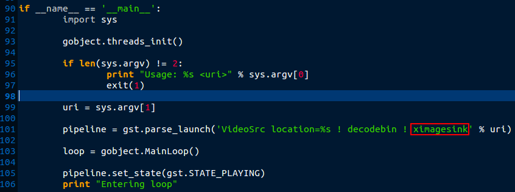
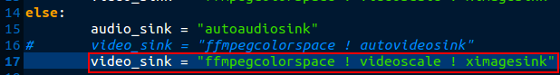
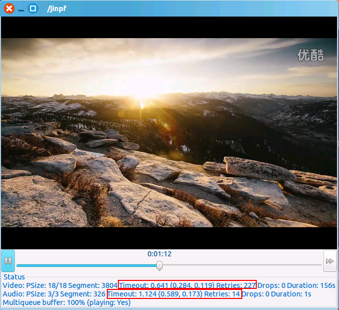
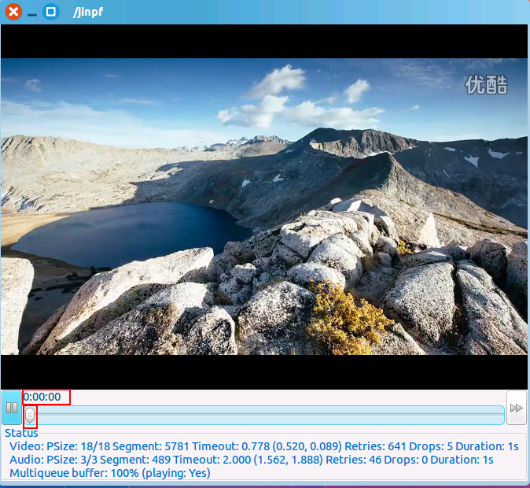
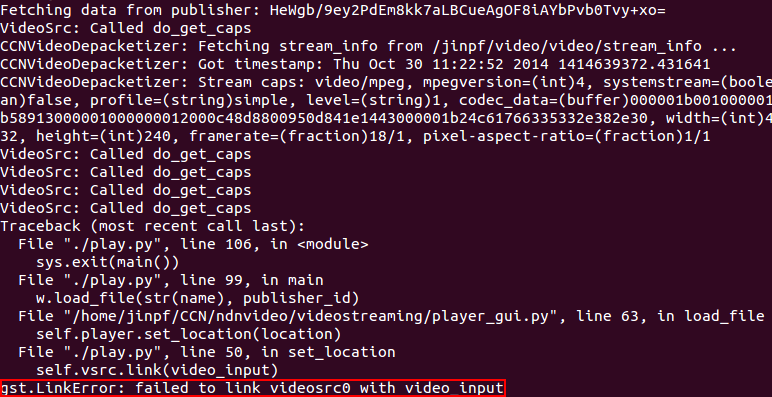

#NDNvideo安装测试记录
NDNvideo是一个发布和播放在线视频的基于NDN的工具。代码地址：[https://github.com/remap/ndnvideo](https://github.com/remap/ndnvideo)
##安装
该工具是基于CCNx的，采用python编写的，所以需要安装CCnx、PyCCN，以及流媒体捕获传输的工具gstreamer

官方这样描述：
> Dependencies & installing:
> 
> - ccnx (includes ccnr)
>   If you plan streaming and ccnr crashes when it reaches size around 2GB
>   create file csrc/conf/local.mk with:
>   PLATCFLAGS= -O2 -D_FILE_OFFSET_BITS=64 -fPIC
> 
> - pyccn (git://github.com/remap/PyCCN.git)
> - ndnvideo (play_latest branch - git://github.com/remap/ndnvideo.git)
> 
> - gstreamer 0.10 - will NOT WORK with 1.0... must restrict packages to 0.10 for ndnvideo compatibilty. 

CCNx安装这里不再详细介绍

###PyCCN
基于CCNx的python中间件，为上层应用提供python接口

源代码地址：[https://github.com/named-data/PyCCN](https://github.com/named-data/PyCCN)

<!--lang:shell-->
	git clone https://github.com/named-data/PyCCN.git
	cd PyCCN
	./bootstrap

安装需求：

> - GNU automake 1.11
> - GNU libtool (not sure of minimum version, using 2.2.6b)
> - CCNx 0.4+
> - OpenSSL (need to be linked to the same version used by libccn
> - Python 2.7+ (tested with 2.7.0 and 3.2.1)

然后编译安装
<!--lang:shell-->
	./configure
	make
	#可以尝试执行make check
	make install

###gstreamer
支持流媒体捕获和传输的包

Ubuntu安装命令：
<!--lang:shell-->
	sudo apt-get update
	sudo apt-get install gstreamer0.10-plugins-ugly python-gst0.10-dev gstreamer0.10-ffmpeg

注意：如果提示没有相应的包，可以添加源地址：

用编辑器打开 `/etc/apt/sources.list`，在末尾添加以下内容（北邮的镜像）：

	deb ftp://openware.byr.edu.cn/pub/mirror/ubuntu/ precise main multiverse restricted universe
	deb ftp://openware.byr.edu.cn/pub/mirror/ubuntu/ precise-backports main multiverse restricted universe
	deb ftp://openware.byr.edu.cn/pub/mirror/ubuntu/ precise-proposed main multiverse restricted universe
	deb ftp://openware.byr.edu.cn/pub/mirror/ubuntu/ precise-security main multiverse restricted universe
	deb ftp://openware.byr.edu.cn/pub/mirror/ubuntu/ precise-updates main multiverse restricted universe

之后重新执行上述安装命令。

关于gstreamer安装完毕简单测试（官方要求）：
<!--lang:shell-->
	gst-launch-0.10 videotestsrc ! ximagesink
	gst-launch-0.10 v4l2src ! ximagesink
	gst-launch-0.10 v4l2src ! x264enc ! ffdec_h264 ! ximagesink
	#注意：v4l2中是字母l不是数字1
**注意**，下面两条命令需要有音视频捕获设备才能正确执行。此外，因为 `ximagesink` 和 `xvimagesink` 所支持制式有所不同，直接使用 `gst-launch-0.10 v4l2src ! ximagesink` 会出现如 `Could not negotiate format` 错误，而如果在虚拟机中使用因为没有硬件加速故使用后者会出现 `Could not initialise Xv output`。经我个人测试，以下命令可以调用摄像头：

<!--lang:shell-->
	# 该命令在真机、虚机均可运行
	gst-launch-0.10 v4l2src ! ffmpegcolorspace ! ximagesink
	# 真机可以运行命令（实验室开会用笔记本测试）
	gst-launch-0.10 v4l2src ! xvimagesink
	gst-launch-0.10 v4l2src ! ffmpegcolorspace ! xvimagesink
	## 以下命令因为要对视频源进行编码再解密，因此反映会慢很多
	gst-launch-0.10 v4l2src ! x264enc ! ffdec_h264 ! xvimagesink 

*关于上面命令的含义详细可参考博客：[http://blog.csdn.net/android_lee/article/details/6787977](http://blog.csdn.net/android_lee/article/details/6787977)*

此外python库：
<!--lang:shell-->
	python
	import pygst
如果没有提示出错就表明安装成功

###NDNvideo
直接拷贝下来：
<!--lang:shell-->
	git clone https://github.com/remap/ndnvideo.git

##运行
首先设置环境变量，修改 `~/.profile`，在文件末尾加上：

运行CCN环境：
<!--lang:shell-->
	source ~/.profile
	ccndstart
	ccnr &

###本地视频
因为在虚拟机中进行测试，没有相关硬件视频加速能力等，更改 `ndnvideo/videostreaming/video_src.py` 中相关代码（ `./play.py` 中调用，更改时注意备份）：

原 `xvimagesink` 改为 `ximagesink`

更改 `ndnvideo/videostreaming/utils.py` 为以下：

发布视频：
首先进入到 `ndnvideo/videostreaming/` 下执行：
<!--lang:shell-->
	./ccn_launch.py filesrc location=/home/jinpf/1.mp4 ! typefind ! qtdemux name=mux \
	mux.video_00 ! queue ! VideoSink location=/jinpf/video/video \
	mux.audio_00 ! queue ! AudioSink location=/jinpf/video/audio
	
输入 `ccnexplore &` 显示如下：

播放视频：
<!--lang:shell-->
	#另开一个终端，观看视频，将运行结果输出到video_log中
	./play.py /jinpf | tee video_log

播放成功：

####问题：

下面数据显示超时重传次数很多，多次出现进度条回退到0的现象，同时拖拽进度条不太流畅。

此外，并不是所有视频都能够播放成功，目前经测试，有视频发布成功但是播放不成功。

