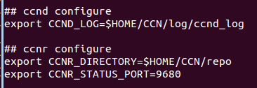
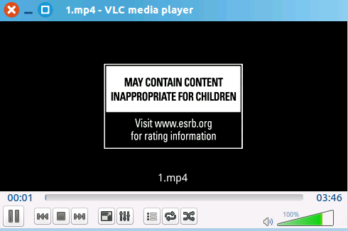

#CCNx使用VLC播放视频实验过程
参考教程：[http://www.ndner.cn/?p=426](http://www.ndner.cn/?p=426)（该教程里面关键部分在我做实验中不成功，故自己摸索重新整理）

##实验前提
* 编译安装好CCNx
* 配置CCNx环境变量，我的 `~/.profile` 文件末尾这样配置：

* 下载 VLC 源码，地址：[https://github.com/videolan/vlc](https://github.com/videolan/vlc)
* 下载码率不高的小视频

##编译安装VLC
###安装VLC
<!--lang:shell-->
	# 安装编译vlc要用的包
	sudo apt-get build-dep vlc
	# 安装vlc所需的库文件（注：我当时是在安完vlc因为少东西无法正常启动才安装的这个库）
	sudo apt-get install libvlc-dev

	# 进入vlc目录下，我编译的是2.2.0版本的
	git checkout 2.2.0-git
	./bootstrap
	./configure
	make
	sudo make install

	# 之后便可以正常启动
	vlc
###安装VLC的CCNx插件
<!--lang:shell-->
	# 进入CCNx源码目录
	cd /apps/vlc/
	#因在ubuntu下，复制并命名Makefile
	cp Makefile.Linux Makefile
	#编译安装
	make
	sudo make install
##运行vlc
###打开ccn并将文件放到ccn网络中
<!--lang:shell-->
	ccndstart
	ccnr &
	ccnputfile ccnx:/jinpf/1.mp4 ~/CCN/test_file/ff.mp4
	ccnexplore &
在ccnexplore里可以看到：

###打开VLC播放网络视频：
<!--lang:shell-->
	vlc

播放：

可以自由拖拽：

wireshark抓包（编译可以识别ccn包的wireshark教程：[http://www.ndner.cn/?p=366](http://www.ndner.cn/?p=366)）：

其中有意思的关于 **文件如何命名** 可以通过以下命令查看：
<!--lang:shell-->
	ccnnamelist $CCNR_DIRECTORY/repoFile1 | less

部分显示如下：

